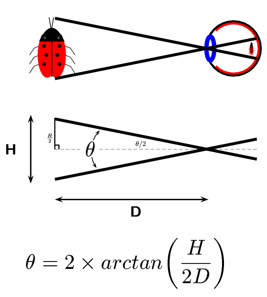

### ⏳ 2022-09-10 🏷️ css 

# 01-关于移动端适配，你必须要知道的

> 原文：[关于移动端适配，你必须要知道的 - code 秘密花园](https://blog.conardli.top/2019/05/17/cross-platform/reactive/)

1）英寸

- 一般用英寸描述屏幕的物理大小
- `inch` -> 缩写 `in` -> 荷兰语中的本意是大拇指，一英寸就是指甲底部普通人拇指的宽度
- `1 英寸 = 2.54 厘米`
- iPhone SE -> `4.7in` -> 屏幕对角线的长度

➹：[iPhone SE - 技术规格 - Apple （中国大陆）](https://www.apple.com.cn/iphone-se/specs/)

2）分辨率

1、像素

- 一个小方块，它具有特定的位置和颜色
- 图片、电子屏幕（手机、电脑）就是由无数个具有 **特定颜色** 和 **特定位置** 的小方块拼接而成
- 可作为图片、电子屏幕的最小组成单位

通常，我们所说的分辨率有两种，屏幕分辨率和图像分辨率

2、屏幕分辨率

- 一个屏幕具体由多少个像素点组成
- iPhone SE -> `1334 x 750` 像素分辨率 -> 垂直 x 水平 -> 这是针对手机的情况
- PC -> `1920 x 1080` -> 水平 x 垂直 -> 宽高
- **分辨率高不代表屏幕就清晰，屏幕的清晰程度还与尺寸有关**

➹：[为什么说 1366 * 768 是「反人类」的分辨率？ - 知乎](https://www.zhihu.com/question/20498510)

➹：[笔记本物理分辨率 1366x768 和 1920x1080？ - 知乎](https://www.zhihu.com/question/64756355)

3、图像分辨率

- 图片含有的像素数
- 一张图片的分辨率 `200 x 500` -> 横向 `200` 个像素，纵向 `500` 个像素 -> 宽高
- 同一尺寸的图片，分辨率越高，图片越清晰 -> 很多时候我们说图片的分辨率就是说图片的尺寸（dimensions）大小


> 尺寸更多是指物理上的长短或大小 -> 两张相同大小的图片，其蕴含的像素数也许不同

 ➹：[图片体积，图片分辨率，图片尺寸之间是啥关系？ - 知乎](https://www.zhihu.com/question/19617114)

4、PPI

- `PPI(Pixel Per Inch)`：每英寸包括的像素数
- 可用于描述 **屏幕的清晰度** 以及一张 **图片的质量**
- 使用 `PPI` 描述图片时，`PPI` 越高，图片质量越高，使用 `PPI` 描述屏幕时，`PPI` 越高，屏幕越清晰
  - `iPhone SE 326 ppi` vs `iPhone 14 Pro 460 ppi` -> 后者屏幕更清晰


💡：如何计算 `PPI`？

手机尺寸为手机对角线的长度，我们通常使用如下的方法计算 `PPI`：

> 对角线的像素点数 / 手机尺寸 -> 500 块/10 斤 = 50 块/斤（每斤 50 块）

`iPhone 6` 的 `PPI` 计算：

> 分数是用分式表达成 `{\frac {a}{b}}` 的数


> `{\frac{\sqrt{水平像素点数^2+垂直像素点数^2}}{尺寸}} = {\frac{\sqrt{1334^2+750^2}}{4.7}} = 325.6`

`iPhone 14 Pro` 的 `PPI` 计算：


> `{\frac{\sqrt{2556^2+1179^2}}{6.1}} = 461.4`

➹：[在线 LaTeX 公式编辑器-编辑器](https://www.latexlive.com/##)

5、DPI

- `DPI(Dot Per Inch)`：即每英寸包括的点数
- 这里的点是一个抽象的单位，它可以是屏幕像素点、图片像素点也可以是打印机的墨点
- 使用 `DPI` 来描述图片和屏幕，这时的 `DPI` 应该和 PPI 是等价的，`DPI` 最常用的是用于描述打印机，表示打印机每英寸可以打印的点数

一张图片在屏幕上显示时，它的像素点数是规则排列的，每个像素点都有特定的位置和颜色

然而当你使用打印机进行打印时，打印机可能 **不会规则的将这些点打印出来**，而是使用一个个打印点来呈现这张图像，这些打印点之间会有一定的 **空隙**，这就是 `DPI` 所描述的：打印点的密度。


可见，打印机是如何使用墨点来打印一张图像的

因此，**打印机的 `DPI` 越高，打印图像的精细程度就越高，同时这也会消耗更多的墨点和时间**

3）设备独立像素

- 上边描述的像素都是 **物理像素**，即设备上真实的物理单元
- 设备独立像素 -> 如何产生？
  - 低分辨率手机 `320x480` -> 页面元素 -> 高分辨率手机 `640x940` -> 按理说，页面元素应该缩小一倍
  - 然而我们现在使用的智能手机，不管分辨率多高，他们所展示的界面比例都是基本类似的
  - 乔布斯在 iPhone4 的发布会上首次提出了 **Retina Display**（视网膜屏幕）的概念，它正是解决了上面的问题，这也使它成为一款跨时代的手机

在 iPhone4 使用的视网膜屏幕中，把 `2x2` 个像素当 `1` 个像素使用，这样让屏幕看起来更精致，但是元素的大小却不会改变


我们通过一种单位，比如 `DIP`（也叫 `DP`）来告知各种分辨率的手机「你们在界面显示元素的大小是多少」 -> 这个 `DIP` 就是设备独立像素（`Device Independent Pixels`）

例如，开发者要显示宽度为 `300px` 的元素，那么不管在什么分辨率的手机界面上，这个设置所展示的就是 `300dp`

> 你在笔记本设置的显示分辨率就是在设置设备独立像素？ -> 准确来说应该是在设置物理像素，也就是让多少个物理像素被激活


1、设备像素比

- 设备像素比 `device pixel ratio` 简称 `dpr`，即物理像素和设备独立像素的比值。

💡：如何获取 `dpr` 这个值？

- 在 web 中，浏览器提供了 `window.devicePixelRatio` 这个 API 来获取 `dpr`
- 在 css 中，我们可用媒体查询 `min-device-pixel-ratio` 来区分该设备是否满足我们设定的 `dpr`
  - `@media (-webkit-min-device-pixel-ratio: 2),(min-device-pixel-ratio: 2){ }`
- 在 React Native 中，通过 `PixelRatio.get()` 来获取 `dpr`

💡：通过 `dpr` 和设备独立像素的相乘是否绝对可以计算出手机的物理像素？

这是不一定的

比如：

`iPhone 6、7、8 Plus` 的实际物理像素是 `1080 x 1920` -> 设备独立像素是 `414 x 736`，设备像素比为 `3`

可见，相乘的结果对不上

手机会自动把 `1242 x 2208` 个像素点塞进 `1080 x 1920` 个物理像素点来渲染 -> 借助 `Downsampling` 这个技术（目的：抗锯齿、提高游戏视觉效果）

`1242 x 2208` 被称为屏幕的 `设计像素`。我们开发过程中也是以这个 `设计像素` 为准 -> `@3x` 图片

💡：`dpr` 这个概念是什么时候出现的？

> 从苹果提出视网膜屏幕开始，才出现设备像素比这个概念，因为在这之前，移动设备都是直接使用物理像素来进行展示

💡：苹果机有 `dpr` 这个概念，那 Android 机是不是也是这样呢？

Android 同样使用了其他的技术方案来实现 DPR 大于 `1` 的屏幕 -> 原理类似

由于 Android 屏幕尺寸非常多、分辨率高低跨度非常大，不像苹果只有它自己的几款固定设备、尺寸。所以，为了保证各种设备的显示效果，Android 按照设备的像素密度将设备分成了几个区间：


> 所有的 Android 设备不一定严格按照上面的分辨率，每个类型可能对应几种不同分辨率，所以，每个 Android 手机都能根据给定的区间范围，确定自己的 `DPR`，从而拥有类似的显示。当然，仅仅是类似，由于各个设备的尺寸、分辨率上的差异，设备独立像素也不会完全相等，所以各种 Android 设备仍然不能做到在展示上完全相等

你在手机上可以设置不同的显示分辨率（根据设备的物理像素来设置，一般来说，物理像素是多少，你就设置成多少） -> 这样 `DPR` 的值也会有所不同，比如 `HD+（720 x 1440）、FHD+（2160 x 1080）`，你设置成前者，那 `DPR` 就是 `2`，而后者就是 `3`

💡：笔记本的 `dpr` 都是 `1` 吗？

- 高分屏跟 Retina 屏是一个概念
- 高分屏就是在同样大小的屏幕面积上显示更多的像素点，也就是更多的可视信息

➹：[前端是否有方法判断笔记本高分屏？- SegmentFault 思否](https://segmentfault.com/q/1010000014855931)

➹：[电脑的屏幕都有什么差别，如何选择？ - 知乎](https://www.zhihu.com/question/53243396)

2、移动端开发

- 在 iOS、Android 和 React Native 开发中样式单位其实都使用的是 **设备独立像素**
- iOS 的尺寸单位为 `pt`，Android 的尺寸单位为 `dp`，React Native 中没有指定明确的单位，它们其实都是设备独立像素 `dp`

💡：开发 App 时，我们如何理解 UI 给的原型图？

在使用 React Native 开发 App 时，UI 给我们的原型图一般是基于 iPhone6 的像素给定的 -> **物理像素** -> `750`

为了适配所有机型，我们在 **写样式时需要把物理像素转换为设备独立像素**：

例如：如果给定一个元素的高度为 **200px**（这里的 `px` 指物理像素，非 CSS 像素），iphone6 的设备像素比为 `2`，我们给定的 `height` 应为 `200px/2=100dp`。

> 微信小程序的 `750rpx` -> 来到设计稿不用除以 `2` 了

当然，最好的是，你可以和设计沟通好，所有的 UI 图都按照设备独立像素来出。 -> 也就是 `375`

如果不沟通，我们可以在代码 (React Native) 中进行 `px` 和 `dp` 的转换：

``` js
import {PixelRatio } from 'react-native';

const dpr = PixelRatio.get();

/**
 * px 转换为 dp
 */
export function pxConvertTodp(px) {
  return px / dpr;
}

/**
 * dp 转换为 px
 */
export function dpConvertTopx(dp) {
  return PixelRatio.getPixelSizeForLayoutSize(dp);
}
```

3、WEB 端开发

💡：什么情况下，一个 CSS 像素等于一个设备独立像素？

在写 CSS 时，我们用到最多的单位是 `px`，即 CSS 像素，**当页面缩放比例为 `100%` 时**，一个 CSS 像素等于一个设备独立像素。

💡：什么情况下，一个 CSS 像素不等于一个设备独立像素？

CSS 像素是很容易被改变的，**当用户对浏览器进行了放大，CSS 像素会被放大**，这时一个 CSS 像素会跨越更多的物理像素

💡：`页面的缩放系数 = CSS 像素 / 设备独立像素`？


> 以前的认识：不管怎样，CSS 像素就是设备独立像素 -> 现在的认识：这是有条件的，那就是页面缩放比例为 `1.0` 时

4、关于屏幕

Retina 屏幕只是苹果提出的一个营销术语：

> 在普通的使用距离下，人的肉眼无法分辨单个的像素点。

为什么强调 **普通的使用距离** 下呢？我们来看一下它的计算公式：



> [Visual Angle Primer](http://www.gta.igs.net/~bgbauer/trentweb/366W04/images/visualangle.html)

`0` 代表人眼视角，`h` 代表像素间距，`d` 代表肉眼与屏幕的距离，符合以上条件的屏幕可以使肉眼看不见单个物理像素点。

它不能单纯的表达分辨率和 `PPI`，只能一种表达视觉效果。

让多个物理像素渲染一个独立像素只是 Retina 屏幕为了达到效果而使用的一种技术。而不是所有 `DPR > 1` 的屏幕就是 Retina 屏幕。

比如：给你一块超大尺寸的屏幕，即使它的 `PPI` 很高，`DPR` 也很高，但在近距离你也能看清它的像素点，那这就不算 Retina 屏幕。


我们经常见到用 `K` 和 `P` 这个单位来形容屏幕：

`P` 代表的就是屏幕纵向的像素个数，`1080P` 即纵向有 `1080` 个像素，分辨率为 `1920X1080` 的屏幕就属于 `1080P` 屏幕。

我们平时所说的高清屏其实就是屏幕的物理分辨率达到或超过 `1920X1080` 的屏幕。

`K` 代表屏幕横向有几个 `1024` 个像素，一般来讲横向像素超过 `2048` 就属于 `2K` 屏，横向像素超过 `4096` 就属于 `4K` 屏。

4）视口

视口 (`viewport`) 代表当前可见的计算机图形区域。

在 `Web` 浏览器术语中，通常与浏览器窗口相同，但不包括浏览器的 `UI`， 菜单栏等——即指 **你正在浏览的文档的那一部分**。

一般我们所说的视口共包括三种：布局视口、视觉视口和理想视口，它们在屏幕适配中起着非常重要的作用。

- [视口概念 - CSS（层叠样式表） - MDN](https://developer.mozilla.org/zh-CN/docs/Web/CSS/Viewport_concepts)
- [布局视口、视觉视口和理想视口分别是什么？](https://www.itheima.com/news/20200910/171437.html)

1、布局视口


布局视口 (`layout viewport`)：当我们以百分比来指定一个元素的大小时，它的计算值是由这个元素的包含块计算而来的。当这个元素是最顶级的元素时，它就是基于布局视口来计算的。

所以，布局视口是网页布局的基准窗口，在 `PC` 浏览器上，布局视口就等于当前浏览器的窗口大小（不包括 `borders` 、`margins`、滚动条）。

在移动端，布局视口被赋予一个默认值，大部分为 `980px`，这保证 `PC` 的网页可以在手机浏览器上呈现，但是非常小，用户可以手动对网页进行放大。

我们可以通过调用 `document.documentElement.clientWidth / clientHeight` 来获取布局视口大小。


页面放大两倍的情况：


> 视口 -> 浏览器窗口的视口宽度 -> 包括垂直滚动条 -> 通过 `Window.innerWidth` 获取
> 
> 布局视口 -> 只知道不包括垂直滚动条 -> 通过 `document.documentElement.clientWidth` 获取

2、视觉视口


视觉视口 (`visual viewport`)：用户通过屏幕真实看到的区域。

视觉视口默认等于当前浏览器的窗口大小（包括滚动条宽度）。

**当用户对浏览器进行缩放时，不会改变布局视口的大小，所以页面布局是不变的，但是缩放会改变视觉视口的大小**。

例如：用户将浏览器窗口放大了 `200%`，这时浏览器窗口中的 `CSS 像素` 会随着视觉视口的放大而放大，这时一个 `CSS` 像素会跨越更多的物理像素。

所以，布局视口会限制你的 `CSS` 布局，而视觉视口决定用户具体能看到什么。

我们可以通过调用 `window.innerWidth / innerHeight` 来获取视觉视口大小。

> 布局视口为 `980px` 时，在 `375px` 这个视觉视口显示时，其缩放比例就是 `980/375 = 2.61` -> PC 页面在移动端显示时，会缩小页面，也展示全部页面的全部内容，此时，你放大页面，是在放大视觉视口的宽度，而布局视口是不变的

3、理想视口


布局视口在移动端展示的效果并不是一个理想的效果，所以理想视口 (`ideal viewport`) 就诞生了：网站页面在移动端展示的理想大小。

如上图，我们在描述设备独立像素时曾使用过这张图，在浏览器调试移动端时页面上给定的像素大小就是理想视口大小，它的单位正是设备独立像素。

上面在介绍 `CSS 像素时` 曾经提到 `页面的缩放系数 = CSS 像素 / 设备独立像素`，实际上说 `页面的缩放系数 = 理想视口宽度 / 视觉视口宽度` 更为准确。

所以，当页面缩放比例为 `100%` 时，`CSS 像素 = 设备独立像素`，`理想视口 = 视觉视口`。

我们可以通过调用 `screen.width / height` 来获取理想视口大小。

> 当布局视口的宽度 = 视觉视口，那么这种布局视口才是我们想要的

4、Meta viewport

`<meta>` HTML 元素表示其他 HTML 元相关元素无法表示的元数据，如 `<base>` 、 `<link>` 、 `<script>` 、 `<style>` 或 `<title>` ，它可以告诉浏览器如何解析页面。

我们可以借助 `<meta>` 元素的 `viewport` 来帮助我们设置视口、缩放等，从而让移动端得到更好的展示效果。

```html
<meta name="viewport" content="width=device-width; initial-scale=1; maximum-scale=1; minimum-scale=1; user-scalable=no;">
```

上面是 `viewport` 的一个配置，我们来看看它们的具体含义：

| `Value`         | 可能值                      | 描述                                                      |
| --------------- | --------------------------- | --------------------------------------------------------- |
| `width`         | 正整数或 `device-width`      | 以 `pixels`（像素）为单位， 定义布局视口的宽度。           |
| `height`        | 正整数或 `device-height`     | 以 `pixels`（像素）为单位， 定义布局视口的高度。           |
| `initial-scale` | `0.0 - 10.0`                | 定义页面初始缩放比率。                                    |
| `minimum-scale` | `0.0 - 10.0`                | 定义缩放的最小值；必须小于或等于 `maximum-scale` 的值。     |
| `maximum-scale` | `0.0 - 10.0`                | 定义缩放的最大值；必须大于或等于 `minimum-scale` 的值。     |
| `user-scalable` | 一个布尔值（`yes` 或者 `no`） | 如果设置为 `no`，用户将不能放大或缩小网页。默认值为 yes。 |

5、移动端适配

为了在移动端让页面获得更好的显示效果，我们必须让布局视口、视觉视口都尽可能等于理想视口。

`device-width` 就等于理想视口的宽度，所以设置 `width=device-width` 就相当于 **让布局视口等于理想视口**。

由于 `initial-scale = 理想视口宽度 / 视觉视口宽度`，所以我们设置 `initial-scale=1;` 就相当于 **让视觉视口等于理想视口**。

这时，1 个 `CSS` 像素就等于 1 个设备独立像素，而且我们也是基于理想视口来进行布局的，所以呈现出来的页面布局在各种设备上都能大致相似。

> 理想视口，也是布局视口，所以我只设置 `initial-scale=1;` 也是可以的 -> 这个理解不是很合理

6、缩放

上面提到 `width` 可以决定布局视口的宽度，实际上它并不是布局视口的唯一决定性因素，设置 `initial-scale` 也有肯能影响到布局视口，因为布局视口宽度取的是 `width` 和视觉视口宽度的最大值。

例如：若手机的理想视口宽度为 `400px`，设置 `width=device-width`，`initial-scale=2`，此时 `视觉视口宽度 = 理想视口宽度 / initial-scale` 即 `200px`，布局视口取两者最大值即 `device-width` `400px`。

> 当我只设置 `initial-scale=1;` 时，理想视口宽度就是视觉视口宽度，假设视觉视口宽度是 `375px`，那么理想视口也是 `375px`，因此布局视口取的值就是 `375px`

若设置 `width=device-width`，`initial-scale=0.5`，此时 `视觉视口宽度 = 理想视口宽度 / initial-scale` 即 `800px`，布局视口取两者最大值即 `800px`。

> 在移动端设备中，我们想要的理想视口宽度都是确定的，但页面的缩放系数是小数时，视觉视口变大了，意味着你能看到的内容变多了，而布局视口也因此也变大了

7、获取浏览器大小


> 布局视口高度是 `document.documentElement.clientHeight`

- `window.innerHeight`：获取浏览器视觉视口高度（包括垂直滚动条）。
- `window.outerHeight`：获取浏览器窗口外部的高度。表示整个浏览器窗口的高度，包括侧边栏、窗口镶边和调正窗口大小的边框。
- `window.screen.Height`：获取获屏幕取理想视口高度，这个数值是固定的，`设备的分辨率/设备像素比`
- `window.screen.availHeight`：浏览器窗口可用的高度。
- `document.documentElement.clientHeight`：获取浏览器布局视口高度，包括内边距，但不包括垂直滚动条、边框和外边距。 -> **这个表述是有问题的，应该是视觉视口高度**
- `document.documentElement.offsetHeight`：包括内边距、滚动条、边框和外边距。
- `document.documentElement.scrollHeight`：在不使用滚动条的情况下适合视口中的所有内容所需的最小宽度。测量方式与 `clientHeight` 相同：它包含元素的内边距，但不包括边框，外边距或垂直滚动条。

💡：`clientHeight`？

- `clientHeight`: `Element.clientHeight` 是一个只读属性，返回的是元素对应的高度 `px` 的值，是一个整数值，不存在小数，
  * 对于没有设置样式或者 `inline` 元素而言，返回的是 `0`，
  * 对于 `html` 元素或者怪异模式下的 `body`，返回的是 `viewport` 高度，也就是整个页面视口高度
  * 其他情况下：元素的 `innerHeight + padding`；不包括 `border`、`margin`、滚动条；

➹：[HTML 元素的 height、offsetHeight、clientHeight、scrollTop 等梳理 - SegmentFault 思否](https://segmentfault.com/a/1190000037426695)

➹：[CSSOM View Module](https://www.w3.org/TR/2016/WD-cssom-view-1-20160317/#dom-element-clientheight)

➹：[HTML DOM clientHeight 属性 - 菜鸟教程](https://www.runoob.com/jsref/prop-element-clientheight.html)

➹：[视口的宽高与滚动高度 - Harttle Land](https://harttle.land/2016/04/24/client-height-width.html)

💡：`node document`是什么意思啊？


指的是`document`这个节点吗？ -> 用`<!DOCTYPE html>`启用标准模式

➹：[cssom-view Definition of clientLeft and clientTop doesn't make sense for the document scrolling element. · Issue #5363 · w3c/csswg-drafts](https://github.com/w3c/csswg-drafts/issues/5363)

5）1px 问题

