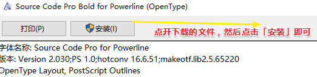
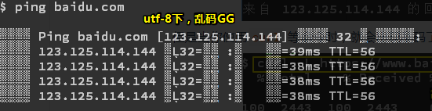

# 命令行技巧1

> 写程序不学命令行，不如回家卖红薯

## ★自动跳转目录

### ◇为什么？

因为我们平时经常性的cd来cd去的，显然这很麻烦哈！

如果有个工具可以让我们不需要知道目录的全称和路径，就可以跳转到该目录，那该多好啊！

### ◇怎么做

1. 找个好位置（如我在  `/g/temp-git-2019`目录下），clone这个仓库：[rupa/z: z - jump around](https://github.com/rupa/z)，一般来说clone自己的仓库用ssh，其它人的就用https就好了

   

   结果：

   

2. 获取z路径：

   ```bash
   # 直接敲下pwd，就可直接拿到当前目录的路径
   pwd
   # 选中即复制（bash默认的，但也可以设置）
   # 鼠标中键即粘贴
   ```

   把拿到的路径加个 `z.sh`，我的如下：

   ```
   /g/temp-git-2019/z/z.sh
   ```

   这个就是 `z.sh`的绝对路径啦！

3. 把这个路径写到 `~/.bashrc`里边去，那么这该如何写呢？可以使用bash在安装时选择的自带vi编辑器（`i`「插入」、`!wq`「保存并退出」），也可以使用你的vscode，我在这里是使用vscode的，在安装这个软件的时候，它自动就配置到环境变量里边去了，所以可有：

   ```bash
   code ~/.bashrc
   ```

   然后你就在该文件里边，添加这行代码，然后保存即可：

   ```bash
   # 这个点.是source的缩写，一般用.即可，注意一定要确保这个z.sh文件存在
   . /g/temp-git-2019/z/z.sh
   ```

   接着，重启你的gitbash，让上边这行代码生效

4. 为`z`添加别名 `j`

   ```bash
   alias j='z'
   ```

小结：

- 去过哪个目录`j`都会记录下来，当你想进入你曾经想去过的目录时，只需要写**一小段提示**即可进入该目录！
- 直接敲下一个 `j`命令，会展示你曾去过哪些目录，这样当你忘记了曾去过哪些目录的时候，它的作用就体现出来了！
- 修改了 `.bashrc`这个文件 之后，就得重新启动一下GitBash，来让这个文件生效，而这种姿势是最快的！还有一种姿势是 `. ~/.bashrc`，这种姿势不需要重启！不过相较于前者来说，还是前者更简单方便些！
- 注意，别把`z.sh`给删了，不然这个 `j`命令就无法使用了！

## ★使用bash alias 快速输入命令

> 注意：在为命令给别名的时候，一般使用的是单引号，当然，双引号也能用，不过，很有可能会出问题！

```bash
alias j='z'
alias cdd="cd /g/git-2019"
alias gst='git status -sb'
alias ga="git add"
alias gc="git commit -v" 
alias gcc="git commit . -m update"
alias gp="git push"
alias st="start"
alias ll="ls -la"
alias glog="git log --color --graph --pretty=format:'%Cred%h%Creset -%C(yellow)%d%Creset %s %Cgreen(%cr) %C(bold blue)<%an>%Creset' --abbrev-commit --"
```

一个小细节：


关于`git commit -v`，它会让你在vim编辑器之下输入一大串文本用来解释你刚刚对仓库所做出的更改（会提示你之前做 哪些更改，当然你也可以用vscode内置的git管理工具），这样当你在浏览历史的时候，就会知道你当时做了什么操作，而直接 `gcc`那种姿势，显然不能让你写很多字符，而且也很难回忆起之前所做的种种改动！


其它alias：


小结：

1. 如何设置alias？——很简单直接 `alias xx=’balabala……‘` ，优先使用单引号，有些特殊的语句用双引号，如后边的`glog`（默认的`git log`有很多信息噪音，而且显得很长），注意历史记录有点长，你可以摁`q` 推出，摁回车往下查看。看了以往的历史记录，真得不知道当时都干了哪些操作！
2. 设置完成后，重启或 `. ~/.bashrc`或 `source ~/.bashrc`让该文件生效起来！

## ★让Git Bash外观变得更好看些

1. 调整当前窗口大小，选择一个你合适的，你可以在拉伸窗口的时候，看到相应的数值，然后在设置即可：

   

2. 字体：[fonts/SourceCodePro at master · powerline/fonts](https://github.com/powerline/fonts/tree/master/SourceCodePro)

   选择**倒数第三个**这个默认字体，然后点一下**鼠标中间**，那么就会在**新窗口打开**！而不是你用鼠标左键在当前窗口里边打开

   

   那么下载这个字体是否已经足够了呢？——足够了，不过，还是推荐你再下载一个粗体！当然，你可以全部都下载下来（先把所有窗口打开，然后在一个个下载，而不是点开一个窗口就下载一个）然后都安装即可，芳芳就是这种姿势

   

   于GitBash里边的配置：

   

   

   我最终配置的是半粗体 [fonts/Source Code Pro Semibold for Powerline.otf at master · powerline/fonts](https://github.com/powerline/fonts/blob/master/SourceCodePro/Source%20Code%20Pro%20Semibold%20for%20Powerline.otf)

3. 关于乱码的问题：

   在gbk下：

   

   但是当你使用`curl` 等命令时，就会出现乱码了：（这个里边的文字颜色是改不了的，都是程序自己设定的）

   

   而在utf-8下：

   

   

   所以为啥会这样呢？——因为这个`ping`命令时windows里边的，而windows里边的命令默认使用GBK，而我们大部分网页默认使用的是utf-8。所以要么这个乱码，要么那个乱码，不可能两个都不乱码！不管怎样，还是选择utf-8，毕竟ping出来的结果是可以看得出的！或者你可以使用cmd去ping！

4. 还有可以更选主题，我用的是「无」

   

## ★让windows 支持 tree

tree命令是啥？——就是把你当前目录的所有结构给打印出来！

默认情况下：


我们是没有这个tree命令的

所以我们需要去安装这个命令才行，那么如何安装呢？

先去这里：

[lukesampson/scoop: A command-line installer for Windows.](https://github.com/lukesampson/scoop)

安装一个叫`scoop`的工具

这个工具的安装需要在另外一个命令行工具PowerShell里边才能安装，因为它支持 `iex`命令呀！而Git Bash则不支持这个命令，总之「**每个命令行所支持的命令是不一样的，如cmd支持tree，而Git Bash则不支持tree**」

**①打开PowerShell，执行以下命令：**

```bash
iex (new-object net.webclient).downloadstring('https://get.scoop.sh')
```


那么就执行这行呗：


一些小技巧：

关于配置用户环境变量：


```bash
[environment]::setEnvironmentVariable('SCOOP','D:\App\Scoop','User')
$env:SCOOP='D:\App\Scoop'
```

在这里边，第一行表示初始化`SCOOP`环境变量为 `'D:\App\Scoop`。而第三个参数 `User`则是用户级别，还有`Process`是仅当前进程有效，`Machine`是系统环境变量且需要管理员权限。

在你安装scoop前，如果执行了上面的两条命令的话，那么这个scoop就会安装在这儿：


➹：[做一个自动配置JDK环境变量的Powershell脚本 - 简书](https://www.jianshu.com/p/f1d1ed3344a1)

接着我们要配置程序的自定义安装目录：

```bash
[environment]::setEnvironmentVariable('SCOOP_GLOBAL','D:\GlobalScoopApps','Machine')
$env:SCOOP_GLOBAL='D:\GlobalScoopApps'
```


额……算了，我还是不继续下去了……万一改了啥东西，然后系统蹦了咋办，毕竟我没有系统学习过PowerShell啊，况且现在并不是到了非得这样搞的地步……所以，千万不要说我「你很**怂**」

➹：[PowerShell注册表（五）注册表权限 – PowerShell 中文博客](https://www.pstips.net/permissions-in-the-registry.html#i-2)

**②去Bash里边看看，有没有这个scoop命令**

> 在安装这个scoop工具的时候，我们就在用户环境变量里边给配置了，所以必然是能找到这个scoop的


**③安装tree**

```bash
 scoop install tree
```

然而没有找到这个工具哈！

所以这种姿势是无法安装tree的！

至此，我们就去看看另外一种姿势：

来自 <https://xiedaimala.com/bbs/topics/184#/>：

> 1. 下载 [GnuTree.exe](https://newcontinuum.dl.sourceforge.net/project/gnuwin32/tree/1.5.2.2/tree-1.5.2.2-setup.exe) 双击安装，一路下一步（注意安装路径里不要有空格，建议安装在 C:\GnuWin32
> 2. 将 C:\GnuWin32\bin 添加到 PATH 里，添加方法如下：
>    1. Git Bash 添加方法
>       1. 运行 `touch ~/.bashrc; echo 'export PATH="$PATH:/c/GnuWin32/bin/"' > ~/.bashrc` 
>       2. 重启 Git Bash
>    2. 图形界面添加方法
>       1. 在 Windows 的环境变量 PATH 里添加 C:\GnuWin32\bin
>       2. 如果不知道 Windows 怎么添加环境变量 PATH，百度『Windows 环境变量 PATH』即可
> 3. 然后你就可以运行 tree 命令了

注意：如果 `.bashrc`这个文件已经存在了，即里边有内容了，那么你echo的时候，是追加（两个`>>`），而不是覆盖：（我没有找到撤销echo的操作）

> 注意一定要用双引号包裹这个路径，而不是单引号，不然这是不行的

```bash
echo 'export PATH="$PATH:/d/GnuWin32/bin/"' >> ~/.bashrc
```

那么如何查看是否添加成功呢？

```bash
env
#使用Bash的搜索功能，匹配GnuWin32即可
```

你会发现在用户的PATH变量里边追加了这么一个路径

**④测试tree的功能：**

中文路径没有显示出来，我试了好几个方案都不行

于是我就用了基于node的一个工具 `tree-cli`：

安装（我之前装了node了，所以npm是自带的！）：

```
npm install -g tree-cli
```

重启bash，测试如下：


当然，这种姿势，相较于之前那种，会显得文件比较大！不过也就是不到2M吧！

➹：[在windows终端里面使用tree命令 - zihan-smile](http://sunshiyong.com/2018/05/13/tree-win/)

## ★小结

- 为什么学会使用命令行？——因为命令行是最能表达一个程序的意图的这么一个界面！你使用鼠标点，虽然简单快捷，但始终咩有命令行方便快捷！

  如芳芳的vim里边的操作：

  1. 删除单引号里边的值（如配置alias），`CI'`:change in 单引号里边的值，同理双引号也是如此
  2. 删除当前行：`dd`
  3. 删除最后一行： `G+dd`

  总之，命令行永远比鼠标要快，只要你记得快捷键足够多，那么就可以让别人看不出来你在摁什么！

- 当你搭建Python、Ruby、go等环境的时候，请用scoop这个包管理器！

## ★Q&A

### ①什么时候使用命令行？什么时候使用图形界面？

只有浏览器是使用图形界面，其它的能用命令行就用命令行

如写代码进入编辑器（如vim）写，看页面的时候就进入浏览器呗！总之，作为一个程序员，完成我们的日常工作，就只需要命令行（如Bash）、编辑器（如VS Code）、浏览器（如 Chrome）

对于我而言（使用图形界面的）还有：

1. 需要记笔记的：Typora
2. 需要听歌的：网易云音乐

### ②对Scoop的再次认识？

在了解它之前，我想你得先了解「包管理系统」这个概念才行。

包管理系统，顾名思义就是**程序软件包的安装工具，可以管理操作系统上的软件**

如：

| 系统          | 工具        | 范例                       | 备注                |
| ------------- | ----------- | -------------------------- | ------------------- |
| Arch Linux    | Pacman      | pacman -S pyenv            | Built-in（内建）    |
| CentOS/RHEL   | yum         | yum install python-wheel   | Built-in            |
| Debian/Ubuntu | apt/apt-get | apt install python3        | Built-in            |
| Fedora        | dnf         | dnf install python-pip     | Built-in            |
| macOS         | Homebrew    | brew install python        | 3rd-party（第三方） |
| openSUSE      | zypper      | zypper install python3-pip | Built-in            |
| Windows       | Chocolatey  | choco install docker       | 3rd-party           |

那么这个[Scoop](https://github.com/lukesampson/scoop)是什么呢？

Scoop（勺子）是一个用于Windows的命令行安装程序。

所以，它不是一个包管理工具咯？即它不能等同于yum、Homebres等这些包管理工具……

当然，Scoop 的作者在项目的 GitHub Wiki 中也谈到了， Scoop 只是一个**安装工具**（installer），不应该被称为**包管理器**（package manager）。

不过，对于我们使用者而言，它与我们一般认为的**软件包管理工具**其实很是相似的。

因此，我们大可认为它就是个包管理器或者说是包管理工具！

为何需要包管理器？

我前几天刚重装了个系统，因此我又得重新下载大量软件了。而下载软件的姿势：

1. 找到软件的官网，即搜索
2. 下载
3. 安装

以上3个步骤大概做了20多次……所以，这未免也太繁琐了吧！

因此，Scoop等一系列的包管理器就诞生了，而这里边第一大便利就是省去了上述繁琐的「**搜索 - 下载 - 安装**」的步骤，让我们能够通过「**一行代码**」急速安装。💪

如：

```bash
scoop install sudo
scoop install 7zip
```

可见，一个包管理器，最基础，也是最重要的功能就是 **安装软件**

那么我们该如何安装这个Scoop呢？

1. 打开你的PowerShell

2. 在安装Scoop前，先保证允许本地脚本的执行:

   ```bash
   set-executionpolicy remotesigned -s currentuser
   ```

3. 自定义安装Scoop目录（可选，关于配置安装全局应用的自定义目录无须去管，因为我试了一下，出现了一些莫名其妙的bug，当然你不去试的话，应用也是在 `D:\App\Scoop\apps`这个里边的，而不是所谓的C盘，如果是固态硬盘的话，那么第三步可以GG了，毕竟没有分区 ）：

   ```bash
   [environment]::setEnvironmentVariable('SCOOP','D:\Applications\Scoop','User')
   $env:SCOOP='D:\Applications\Scoop'
   ```

4. 执行下面的命令安装 Scoop（PowerShell才有这个`iex`命令）：

   ```bash
   iex (new-object net.webclient).downloadstring('https://get.scoop.sh')
   ```

5. 测试看看是否安装成功：

   ```bash
   which scoop # /d/App/Scoop/shims/scoop
   scoop help  # 查看scoop使用的说明书
   ```

既然安装好了，那么我们该如何使用它呢？

**①Scoop 基础语法**

Scoop 命令的设计很简单（和 `Homebrew` 等 Unix-style 的工具一样），是「`scoop` + 动作 + 对象」的语法。其中「对象」是可省略的。


我从未想过，理解一些命令可以这样抽象，那么有些命令需要加 `--help`，如我下载的这个`tree-cli`工具：

```bash
tree --help
```

结果：

```bash
  USAGE

    tree <options>

  OPTIONS:

  --help
    outputs a verbose usage listing.
  --version
    outputs the version of tree-cli.
  -a
    all files are printed. By default tree does not print
    hidden files (those beginning with a dot '.'). In no
    event does tree print the file system constructs '.'
    (current directory) and '..' (previous directory).
  -d
    list directories only.
    
  EXAMPLE:

  $ tree

  $ tree -l 2, -o out.txt --ignore [node_modules, test] -d --noreport
```

可见，`--help`等是一下选项对象咯！

那么关于「动作」这个抽象呢？

最常用的几个基础动作有这些：

| 命令      | 动作         |
| --------- | ------------ |
| 🌟search   | 搜索软件名   |
| 🌟install  | 安装软件     |
| update    | 更新软件     |
| 🌟status   | 查看软件状态 |
| uninstall | 卸载软件     |
| info      | 查看软件详情 |
| home      | 打开软件主页 |

🌰 举几个栗子，测试一下这些基础动作：

- 我们想要搜索一下有没有 Firefox 浏览器：`scoop search firefox`

  

  选择一个符合你要求的版本！

- 我们想要安装 aria2 下载器：`scoop install aria2` 

  

- 我们想要看看 Typora 的主页：`scoop home typora `

  

  > 没有找到typora！

  为什么会这样呢？——那是因为scoop没有从`Manage Scoop buckets`（**是管理可以用scoop下载APP的列表**）里边找到typora。由于scoop自带的下载APP比较少，所以一些其他第三方的软件需要添加bucket中，而scoop提供了一个`extras`的app列表，来提供更多常用的软件下载，添加姿势如下：

  ```bash
  scoop bucket add extras https://github.com/lukesampson/scoop-extras.git
  ```

  添加之后，再执行它，可见：

  跳转到typora的官网了！同理，跳转到Chrome的官网，也是如此，这样我们就可以找到软件的下载官网了！当然，Chrome的官网需要你科学上网才能访问！

**②Scoop 把软件安装在哪儿？**

> 要想出现 `bucket`目录，需要执行上面那行`scoop bucket add extras ……`命令才行


可以看到，`scoop` 文件夹下的 `apps` 存放有安装的所有应用。值得一提的是：`scoop` 是通过 `shim` 来软链接一些应用，这样的设计**让应用之间不会互相干扰**，十分方便。

**③关于软件包的管理哲学？**

为什么我们推荐使用「包管理」？什么我们需要用「包管理」这个看上去复杂难用的命令行工具去下载、管理我们的软件？照理说，现在的软件管理哲学是「我去 App Store 下一个不就行了嘛？」

至此，这就不得不说，包管理的设计初衷了：

**包管理的设计初衷是为了方便开发者管理和搭建开发环境。**

而用包管理工具能够快速的安装开发工具、开发依赖，从而免去复杂的路径、环境变量等信息的配置。

因此，我们作为普通用户，实际上我们在用「包管理」工具这样的过程，就是在借鉴这种「软件管理哲学」。

> 其实，按照我的理解来说，就是图形界面与命令行的区别！命令行相较于图形界面，显然更方便快捷！更符合这种「软件管理哲学」

总之，最为重要的是，即对我们用户安装基本软件的过程来说：

- **一行代码**省去了搜索、筛选、下载等繁琐步骤
- **安装方便**、**更新方便**、**卸载也方便**
- 同时也最大程度**杜绝了流氓捆绑软件的安装**（因为 Scoop 本身和 Scoop **安装过程参考的配置文件都是开源的**，要安装什么一目了然）

因此，一个包管理工具显然是传统的「**搜索 - 筛选 - 下载**」的软件管理过程带来的复杂过程和安全隐患的极佳解决方法。

题外话：

照理说，应该会有个叫`persist` 的目录，用于存储用户所使用软件数据

还有就是我怎么知道哪些软件是可以安装的呢？

➹：[「一行代码」搞定软件安装卸载，用 Scoop 管理你的 Windows 软件 - 少数派](https://sspai.com/post/52496)

➹：[Windows下的包管理工具scoop - 简书](https://www.jianshu.com/p/bb0ba62b519c)

➹：[再谈谈 Scoop 这个 Windows 下的软件包管理器 - Chawye Hsu, H404bi](https://www.h404bi.com/blog/2018/05/talk-about-scoop-the-package-manager-for-windows-again/)

➹：[windows下的软件管理神器:scoop - jiayaoO3O's Blog](https://jiayaoo3o.github.io/2019/01/30/windows%E4%B8%8B%E7%9A%84%E8%BD%AF%E4%BB%B6%E7%AE%A1%E7%90%86%E7%A5%9E%E5%99%A8-scoop/)

➹：[给 Scoop 加上这些软件仓库，让它变成强大的 Windows 软件管理器 – 技术宅](https://jszbug.com/7gtwknbs.html)

### ③关于这个图标🌟？

表情图标百科（英语：Emojipedia）是一个表情图标参考网站，记载了Unicode标准中各个表情图标的编码、含义、演变等信息。

网站同时也是Unicode联盟的一员，提供了Unicode网站上的**部分彩色表情图标**。

➹：[表情图标百科 - 维基百科，自由的百科全书](https://zh.wikipedia.org/wiki/%E8%A1%A8%E6%83%85%E5%9C%96%E6%A8%99%E7%99%BE%E7%A7%91)

➹：[🌟 Glowing Star Emoji](https://emojipedia.org/emoji/%F0%9F%8C%9F/)

### ④关于对PowerShell的调色？

不想用第三方Shell的，可以试试微软官方出的Powershell的调色主题工具：

➹：[Releases · Microsoft/console](https://github.com/Microsoft/console/releases)

支持iterm的主题，可以直接在Github里面搜iterm的主题，个人喜欢Dracula，<https://draculatheme.com/iterm/>

### ⑤关于软链接？

[百度百科](https://baike.baidu.com/item/%E8%BD%AF%E9%93%BE%E6%8E%A5)的说法：

软链接又叫[符号链接](https://baike.baidu.com/item/%E7%AC%A6%E5%8F%B7%E9%93%BE%E6%8E%A5/7177630)，这个文件包含了另一个文件的路径名。可以是任意文件或目录，可以链接不同文件系统的文件。

> 这个操作在Windows的子系统Ubuntu下，似乎极其常用！

[这篇博客](https://www.jianshu.com/p/b035d94fa959)的说法：

什么是链接？**一种在共享文件和访问它的用户的若干目录项之间建立联系的一种方法。**

- **【硬链接】（hard link）：**指通过索引节点来进行连接，就是一个文件(不是文件夹)的别名，无论有多少各别名，但它其实是一个文件。
   可以这样理解：

> 一面墙上有一个洞，洞里放着一个苹果。从墙的这一面看是这个苹果，从墙的另一面看还是同一个苹果
>  也就是说同一块数据但有两个不同的名字，读写的时候本质上都是修改的同一块数据。

这个比喻可以类比JavaScript的引用类型！

- 【**软链接**】（又称符号链接，即 soft link 或 symbolic link）：相当于我们 Windows 中的快捷方式，即如果你软链接一个目录，只是一个目录的快捷方式到指定位置，操作系统找这个快捷方式会直接找到真实目录下的文件。
  可以这样理解：

> 我声称我有一个苹果，但是当你找我要的时候，我对你说，到某个建筑物的仓库就可以拿到那个苹果了。可见我并不真正拥有一个苹果，我只是拥有“某个地方有一个苹果”这个信息。但对于外部的观察者来说，这跟我实际上拥有一个苹果并无差异。

