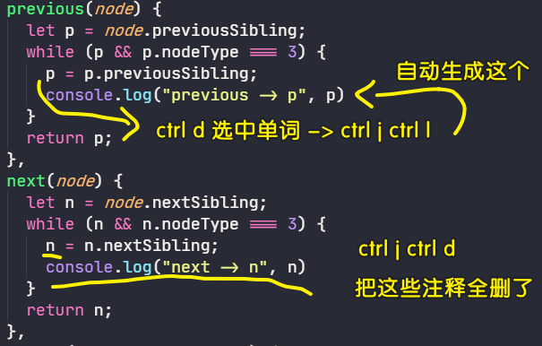
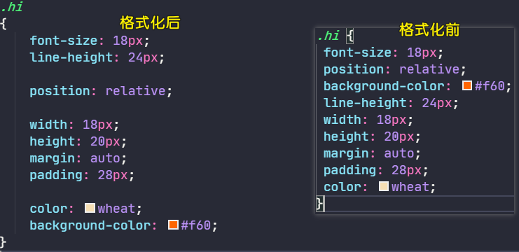
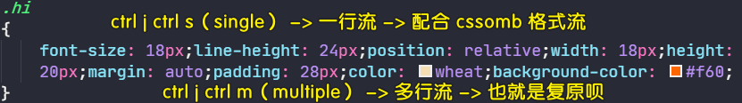
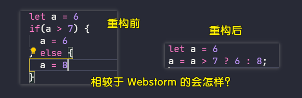
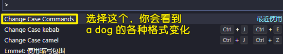

### ✍️ Tangxt ⏳ 2020-11-10 🏷️ vscode

# 01-快捷键 & 配置

## ★常用快捷键

文档：[VS Code 快捷键](https://code.visualstudio.com/shortcuts/keyboard-shortcuts-windows.pdf)

## ★插件配置 & 自定义快捷键

### <mark>1）Turbo Console Log：让你不用手敲 log</mark>



```
ctrl+j ctrl+l 选中变量之后，使用这个快捷键生成 console.log

<!-- 不需要选中变量 -->
ctrl+j ctrl+c 注释（comment）所有 console.log
ctrl+j ctrl+u 启用所有（uncomment） console.log
ctrl+j ctrl+d 删除所有 （delete）console.log
```

### <mark>2）CodeBing：让你不用打开浏览器搜索内容</mark>


```
ctrl+j ctrl+f 谷歌搜索（你好）「这是默认的」，变量命名（c 你好），必应搜索（b 你好），b 站搜索（bi 前端），维基（wiki），油管（yt），GitHub（gh），Stack Overflow（so）
```

配置 `"codebing.defaultProvider": "g"`后，选中文本，直接摁 `ctrl+j ctrl+f`，就能直接谷歌搜索选中的内容了，无须弹框后再输入

Codelf：你可以把它的源码 `clone` 到 Gitee，然后启动 Gitee Pages 服务，这样访问速度就快很多了

### <mark>3）CSScomb：让你所写的 CSS 样式属性有顺序</mark>



配置：

``` js
{
  "csscomb.formatOnSave": true, // 保存时自动格式化
  "csscomb.preset": "csscomb" // 格式化模板，其它配置 zen，yandex
}
```

默认自带的 [`csscomb`格式化模板](https://github.com/csscomb/csscomb.js/blob/dev/config/csscomb.json) 是有 bug 的，所以你需要改一下：[代码片段](https://gitee.com/ppambler/codes/a34eg1p6qm2yklhfx8obs77#0-tsina-1-50393-397232819ff9a47a7b7e80a40613cfe1)

使用这个代码片段：

1. 在项目的根目录下新建`csscomb.json`
2. 把代码片段里边的代码拷进去

当然，你也可以直接配置 `"csscomb.preset"`，这样对于每一个项目而言就不用创建一个`csscomb.json`了，不过这配置内容很多，所以这并不推荐！

关于这个格式化模板，有人推荐用腾讯的 AlloyTeam：[Code Guide by @AlloyTeam](http://alloyteam.github.io/CodeGuide/#css-declaration-order) -> 你把`csscomb.json`里边的`"sort-order"`改成是 AlloyTeam 给出的样式属性书写顺序规范就好了！

### <mark>4）css-format-one-line：一个 CSS 选择器就只占一行，占太多的话，文件太长</mark>



### <mark>5）JavaScript Booster（重构你的 JS 代码）</mark>



### <mark>6）change-case</mark>



```
<!-- 选择1个单词：「ctrl+d」，选择多个单词：「ctrl shift <-」 -->
a dog -> ctrl j ctrl z -> aDog
a dog -> ctrl j ctrl e -> a-dog
```

### <mark>7）开发一个项目过程中的一些要做的必要项</mark>

> 这是在写 uni-app 项目时的感受

- Git Blame：可以帮助你拷贝这次提交的远程仓库地址：`"gitblame.commitUrl": "https://${project.remote}/commit/${hash}"` -> 为了在写笔记的时候添加这节课的代码 -> `ctrl j ctrl t` -> 移到到某行刚刚提交的代码，才能拿到刚刚提交的远程仓库地址 -> 有 bug -> 我用自定义代码模板（`markdow.json`，就是一个关于这个项目远程仓库的固定链接地址） + 手动获取本地提交的短 hash（`gsh` -> 自己配置的别名） -> 我用`/dm`+`hash`就能得到这个完整的地址了
- koroFileHeader：生成文件头部注释和函数注释的插件：`"fileheader.customMade": { "Date": "", "LastEditTime": "", "FilePath": "" }`（保存文件或添加文件时，文件头部会多出一段注释，比如这个文件是何时创建的，什么时候更新的，该文件的路径是？） -> 函数注释：`ctrl j ctrl i`
- Prettier：保存文件时使用它自动格式化：`"editor.formatOnSave": true`、`"[javascript]": { "editor.defaultFormatter": "esbenp.prettier-vscode" }` -> 对 `vue` 文件也这样处理一下

添加`.editorconfig`：

```html
[*.{js,jsx,ts,tsx,vue}]
indent_style = space
indent_size = 2
end_of_line = lf
trim_trailing_whitespace = true
insert_final_newline = true

```

你开发 uni-app 项目时，当你提交代码，请把 `unpackage` 给忽略掉

还有请创建两个分支：

1. 第一个分支是自己手动实现的，这是没有看老师讲解前
2. 第二个分支是看老师的讲解后，用老师的做法默写出来

主分支是老师的代码实现

先完成第一个分支，没有实现没关系，主要是发现问题的存在；然后切换到主分支，看老师的实现，并把代码摘抄到主分支；第二个分支默写老师的代码 -> 一共三次

给函数注释请用多行注释，这样一来，悬浮到这个函数名就会有注释提示 -> 单行注释是没有这种效果的

